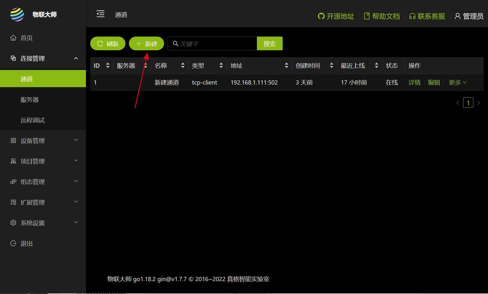
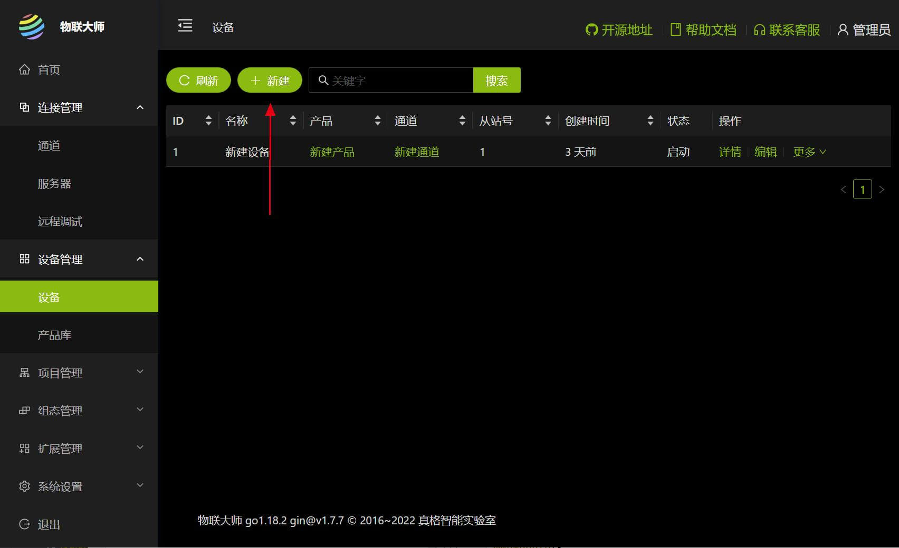
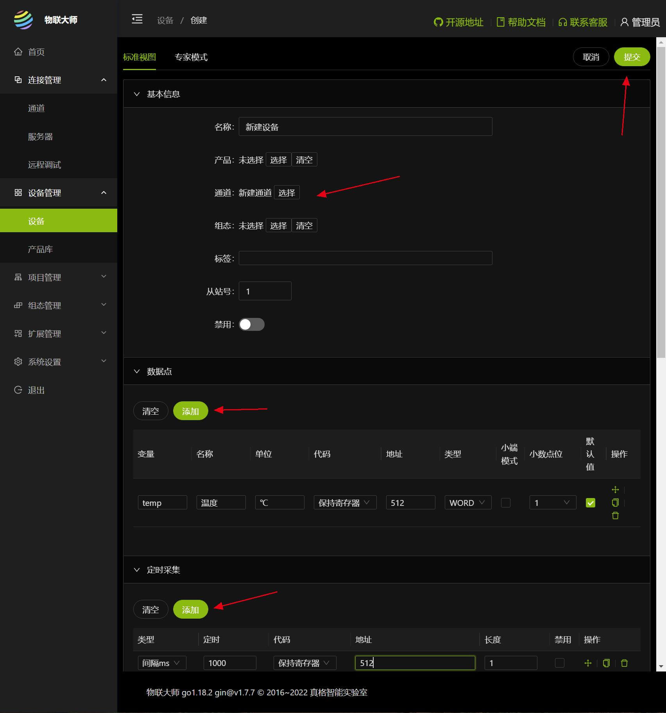
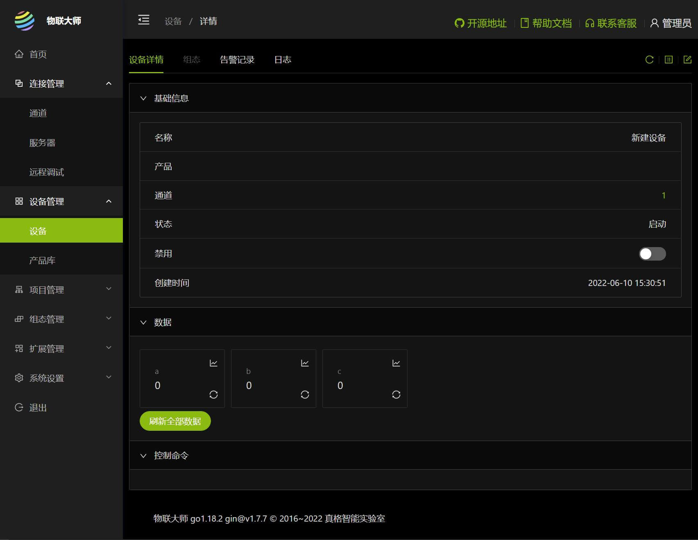
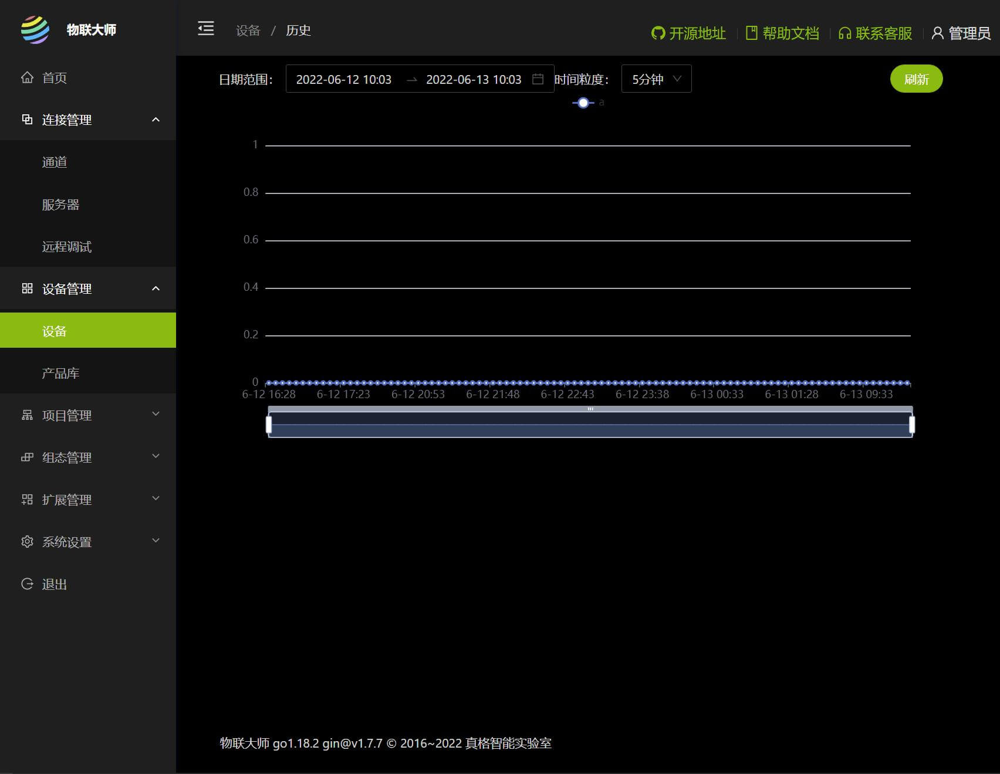

# 快速开始

## 连接管理

## 新建通道

1. 输入串口号（对于TCP或UDP模式，请下拉选择 类型
2. 选择正确的协议
3. 提交创建
4. 创建成功后会提示是否绑定设备，确认继续创建设备

## 设备管理

## 新建设备

1. 选择刚才创建的通道
2. 配置数据点数，具体查看设备的说明文档
3. 配置数据轮询

## 查看设备详情

数据区 显示设备的状态，比如温度

## 查看历史曲线
点击数据块右上角的曲线标志，进入以下页面

